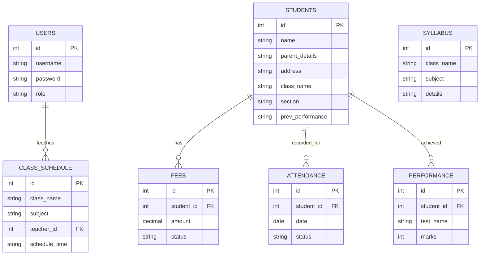

# Entity Relationship Diagram

This diagram represents the database schema for the School Administration System.

```mermaid
erDiagram
    USERS {
        int id PK
        string username
        string password
        string role
    }
    STUDENTS {
        int id PK
        string name
        string parent_details
        string address
        string class_name
        string section
        string prev_performance
    }
    FEES {
        int id PK
        int student_id FK
        decimal amount
        string status
    }
    ATTENDANCE {
        int id PK
        int student_id FK
        date date
        string status
    }
    SYLLABUS {
        int id PK
        string class_name
        string subject
        string details
    }
    PERFORMANCE {
        int id PK
        int student_id FK
        string test_name
        int marks
    }
    CLASS_SCHEDULE {
        int id PK
        string class_name
        string subject
        int teacher_id FK
        string schedule_time
    }

    STUDENTS ||--o{ FEES : "has"
    STUDENTS ||--o{ ATTENDANCE : "recorded_for"
    STUDENTS ||--o{ PERFORMANCE : "achieved"
    USERS ||--o{ CLASS_SCHEDULE : "teaches"
```
